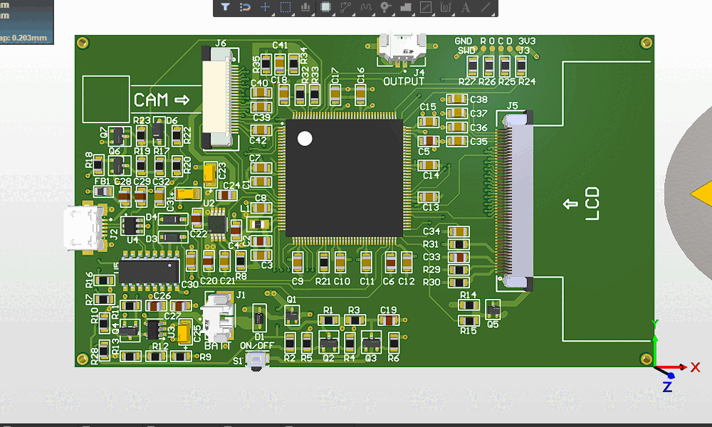

## ARM-Cortex-M4 based Video Intercom System with Human Presence Detection
## _Video domofonski sistem na ARM-Cortex-M4 platformi z zaznavanjem prisotnosti ljudi_

Development of the smart video intercom system based on the ARM Cortex-M4 microcontroller. The system uses a CMOS VGA camera to capture and a WVGA LCD screen to display the video. The ARM MCU controls the camera and the screen in addition to executing the AI algorithm. The software implementation of the camera and LCD screen driver are in this repository.

## See more info in [/Doc](https://github.com/MarioGavran/smart_intercom/tree/master/Doc)

Also, available are various peripheral drivers:
* LCD driver for NT35510 LCD controller chip with various funcions for drawing lines, printing characters, initializing the LCD, etc. :
 [fsmc_driver.c](Core/Src/fsmc_driver.c) and [fsmc_driver.h](Core/Inc/fsmc_driver.h)
* Camera driver for OV7670 CMOS camera, with initialization and configuration functions in various formats:
 [ov7670.c](Core/Src/ov7670.c) and [ov7670.h](Core/Inc/ov7670.h)
* I2C driver:
 [i2c_driver.c](Core/Src/i2c_driver.c) and [i2c_driver.h](Core/Inc/i2c_driver.h)
* Serial COM driver with auto-circular buffer:
 [uart_driver.c](Core/Src/uart_driver.c) and [uart_driver.h](Core/Inc/uart_driver.h)

-The PCBs for v0.0 and v0.1 are home-made, using inkjet printer and semi-transparent paper. The ink is transferred to the board with 50/50 acetone and rubbing alcohol mixture. The board is etched in a ~5% H2O2(30%), ~5% HCl(15%) and ~90% water mixture. Good results regarding the pin pitch size (0,5mm)

## Version 0.0 (only LCD)
-Working prototype for STM Zio connector on the STM Nucleo-144 boards. Used to connect the NT35510 LCD display controller over FSMC i80-like parallel interface bus. 

## Version 0.1 (with camera)
-Added a 24pin connector for the OV7670 camera sensor.

## Version 1.0 (JLCPCB)
-First "real" prototype. Features battery connector and charger, pushbutton to turn the device on/off, micro USB to serial transciever, boot-latch circuit for updating, etc. See pdf documents for more info: [/Doc](https://github.com/MarioGavran/smart_intercom/tree/master/Doc)

 

 
 
 

_More images in_ [/images](https://github.com/MarioGavran/smart_intercom/tree/master/images) _folder_
